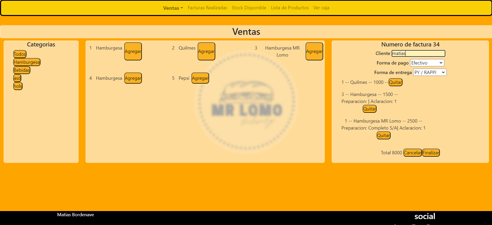
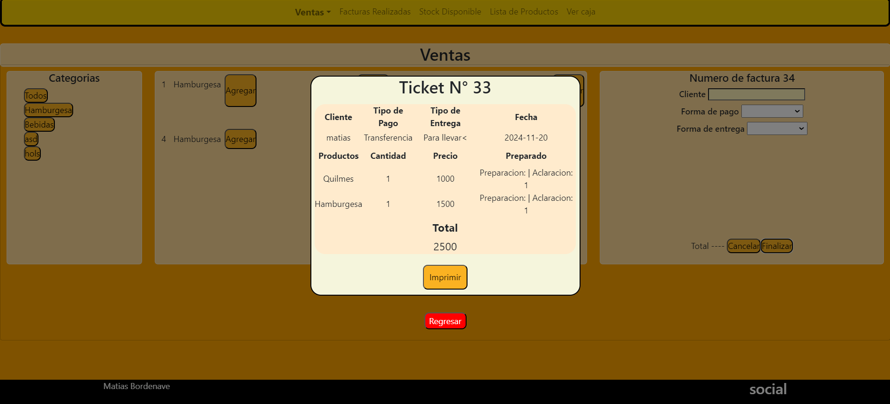
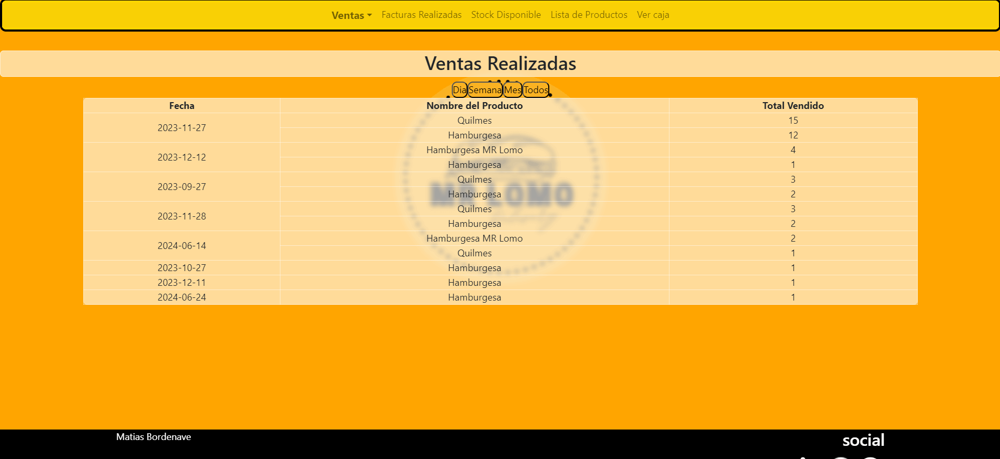
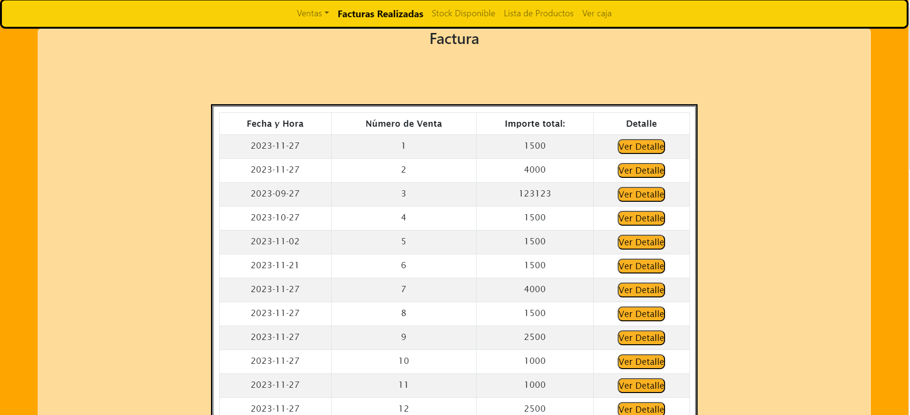
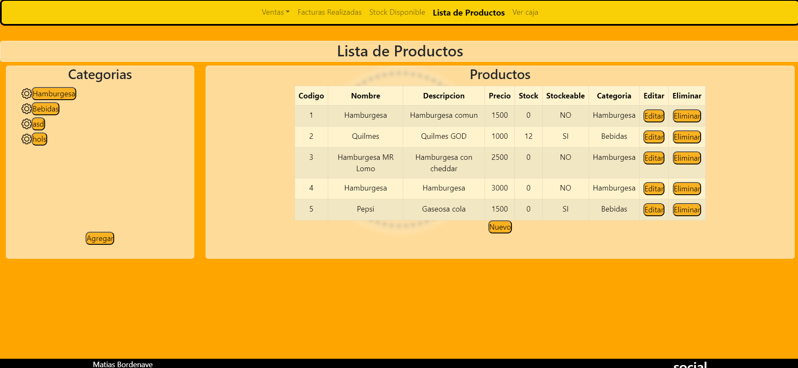
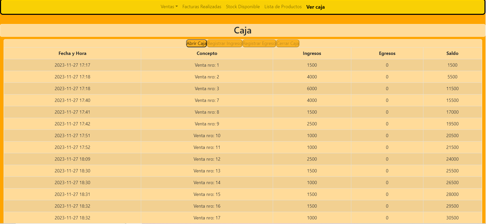

🍔 Restaurante Web - Demo
📌 Descripción

Esta es una aplicación web desarrollada como demo para la gestión de un restaurante.
Permite administrar productos, registrar ventas y generar reportes de manera sencilla.

Entre sus principales funcionalidades:

🛒 Gestión de productos: lista de productos disponibles.

💵 Registro de ventas: realizar ventas de los productos.

🧾 Facturación: ver facturas de ventas realizadas.

📊 Reportes: consultar los productos más vendidos en un día, semana o mes.

💰 Caja diaria: control de ingresos y egresos del día.

🖼️ Capturas de pantalla

Pantalla principal:

Ticket:

Ventas Realizadas:

Facturas:

Lista de Productos:

Caja:

🛠️ Tecnologías utilizadas

Frontend: React

Backend: Node.js + Express

Base de datos: MySQL

Metodologías: SCRUM

📌 Notas

⚠️ Esta aplicación es una demo y no representa un sistema final de producción.

